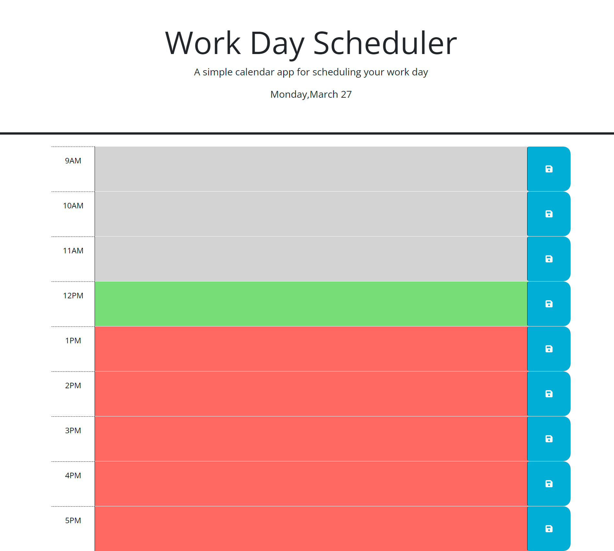

# Work-day-scheduler

## Description

This website is a scheduler. It has eight hours of the day you work and gives you the ability to saved what you type for any gven hour. Dayjs is incorporated to give you an indicator for past, present and futuere.

## Installation

N/A

## Usage

To use the Work day scheduler, you will want to type in the hour you'd like to schedule. When you hit the save button, what you logged will save to that specified hour. 

## Credits

N/A 

## License

Please refer to the LICENSE in the repo.

## Link

https://github.com/mubarak24/Work-day-scheduler

## Screenshot

 